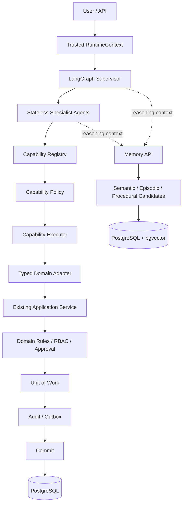

# Agent Refactor Architecture North Star

## 1. Purpose and normative language

This document is the architecture constitution for the Agent refactor. It defines the
stable destination and the boundaries that every migration stage MUST preserve. It does
not describe the implementation plan for a particular pull request.

The key words **MUST**, **MUST NOT**, **SHOULD**, **SHOULD NOT**, and **MAY** express
normative requirements. Statements about the target architecture are not claims that the
current repository already implements that architecture.

## 2. Architecture principle

> **Agent 自主，业务权威不自主。**

The Agent MAY understand intent, search and compare information, build and revise plans,
select capabilities, coordinate specialists, and request human intervention. It MUST NOT
create or override business truth.

Authorization, legal state transitions, approvals, billing facts, repair facts,
inspection facts, tenant/community scope, and transaction correctness remain the sole
authority of Application Services, Domain Rules, RBAC, and PostgreSQL state.

## 3. Final target architecture

The target system consists of:

- a LangGraph Supervisor for durable orchestration;
- stateless specialist agents for domain-oriented reasoning;
- a typed, trusted `RuntimeContext` and a separate mutable `AgentState`;
- a Capability Registry, Policy, and Executor with typed inputs and outputs;
- existing Application Services as the sole business authority; and
- PostgreSQL/pgvector long-term memory used only as reasoning context.

### 3.1 Target dependency direction



Dependencies MUST point from orchestration toward stable domain interfaces. Domain and
Application Service modules MUST NOT depend on LangGraph, specialist agents, capability
metadata, or memory retrieval.

## 4. Business authority boundary

Every Agent-initiated business write MUST preserve this authority chain:

```text
Policy
  -> Approval
  -> Application Service
  -> Unit of Work
  -> Audit / Outbox
  -> Commit
```

The following paths are permanently forbidden:

- LangGraph node -> ORM -> commit;
- specialist agent -> `repository.update(...)`;
- Capability Executor -> direct SQL business mutation;
- LLM output -> declared approval or authorization; and
- memory record -> accepted business truth.

Capabilities, agents, the Supervisor, and LangGraph belong to the orchestration layer.
Typed domain adapters MUST invoke existing Application Services and MUST NOT reproduce
domain rules or transaction ownership.

## 5. Agent autonomy boundary

The Agent MAY:

- interpret user language and classify intent;
- search authorized sources and compare candidate information;
- construct and revise a plan within configured budgets;
- choose one or more allowed capabilities;
- delegate reasoning to appropriate specialists; and
- decide that clarification or human intervention is required.

The Agent MUST NOT:

- grant roles, widen tenant/community/house scope, or choose an execution identity;
- declare an action approved or bypass confirmation requirements;
- invent business facts or legal domain transitions;
- control commit/rollback behavior; or
- treat model confidence, retrieved memory, or conversation text as authorization.

## 6. Capability architecture

The capability layer is the stable contract between Agent orchestration and business
Application Services. It MUST provide:

- discoverable capability specifications;
- typed input and output contracts;
- centralized orchestration metadata such as risk and approval requirements;
- policy evaluation against trusted runtime facts;
- bounded, observable invocation; and
- typed adapters to existing Application Services.

The registry describes what orchestration may request. It is not a Platform domain, a
permission database, or a business authority. Registry metadata MAY narrow access but
MUST NOT grant access that RBAC, domain rules, approval state, or the Application Service
would reject.

## 7. Trusted RuntimeContext boundary

`RuntimeContext` is supplied by trusted server-side composition and MUST be immutable to
the model and to capability arguments. Its target contents include:

- authenticated user identity and roles;
- tenant, community, and house scope;
- execution source;
- conversation identity and Agent run identity;
- active lease and fence data; and
- trace metadata.

The system MUST reject or ignore attempts to inject trusted fields through model-produced
arguments, including `role=admin`, `user_id`, `community_id`, or
`execution_source=HUMAN`. Trusted scope MUST be revalidated at protected boundaries and
after durable resume.

## 8. Typed AgentState target

`AgentState` contains mutable semantic and orchestration state. It MAY include messages,
intent, plan, selected specialist, selected capability, pending action, capability
results, retrieved memories, and handover state.

`AgentState` MUST NOT be the source of truth for identity, authorization, approval,
domain facts, transaction state, lease ownership, or fence validity. Types and reducers
MUST make the boundary between trusted runtime facts and mutable Agent state explicit.

## 9. Stateless specialist principle

Specialists SHOULD be stateless reasoning components. They receive the minimum relevant
state and trusted context, propose capability calls or responses, and return structured
results. They MUST NOT own durable business state, repositories, database sessions,
approval truth, or cross-request in-memory authority.

Durability belongs to graph checkpoints, business persistence, and the memory API—not to
specialist object lifetime.

## 10. Supervisor responsibility

The Supervisor is responsible for high-level routing, planning, specialist selection,
replanning, execution-budget enforcement, result synthesis, and escalation to
human-in-the-loop flows. It MUST operate only through registered capabilities and MUST
respect capability policy outcomes.

The Supervisor MUST NOT implement domain state machines, authorize business operations,
consume approvals independently of the business transaction, or mutate persistence.

## 11. LangGraph responsibility

LangGraph is responsible for durable orchestration: graph transitions, checkpoints,
interrupt/resume, failure recovery, and orchestration-level state progression. It MAY
host deterministic execution guards, but it MUST NOT become the business service layer.

Resume is not authorization. Every resumed operation MUST revalidate the relevant
identity, scope, lease/fence, approval, expiry, parameter binding, and idempotency
conditions at their authoritative boundaries.

## 12. Memory authority boundary

Long-term memory stores semantic, episodic, and procedural candidates for reasoning.
Memory MAY help retrieval, personalization, planning, and learning from prior outcomes.
It MUST be treated as untrusted, revisable context.

Memory MUST NOT authorize access, establish tenant/community scope, prove approval,
replace live Application Service queries, define a domain transition, or become the
source of billing, repair, inspection, or other business truth. Conflicts between memory
and authoritative business state MUST resolve in favor of authoritative business state.

## 13. Safety semantics that MUST survive migration

Migration MUST preserve or strengthen:

- model-untrusted argument guards;
- identity and scope validation;
- capability/tool allowlists;
- execution budgets, step limits, and deadlines;
- duplicate-call detection;
- run lease, heartbeat, and fencing;
- checkpoint and memory compare-and-swap semantics;
- approval atomicity and confirmation binding;
- idempotency;
- audit; and
- transactional outbox behavior.

Legacy implementations such as `controlled_read.py` MAY be retired only after their
required protections have demonstrably moved to Capability Policy, Capability Executor,
or graph execution policy, with regression tests covering equivalent semantics.

## 14. Progressive migration principle

The refactor MUST avoid a big-bang runtime replacement. During migration the system MUST
support, as needed:

```text
legacy runtime + compatibility layer + feature flags + progressive rollout + new runtime
```

Runtime selection MUST be pinned at conversation creation. A pending or
`WAITING_CONFIRM` conversation MUST NOT switch runtimes mid-lifecycle. Legacy
conversations must complete, expire, or be safely drained before their runtime is
retired. Rollback MUST preserve the correctness substrate and business authority
boundary.

## 15. Runner retirement direction

The current Runner is transitional. Capability contracts and metadata move out first;
domain working state and continuation logic move later; orchestration then moves to
LangGraph. The target is a thin compatibility adapter or complete retirement.

New work MUST NOT turn the Runner into a larger general-purpose business or orchestration
framework. Compatibility code SHOULD have an explicit removal condition.

## 16. Architecture success criteria

The target architecture is reached only when all of the following are true:

1. Eligible new conversations execute through the durable LangGraph runtime while
   runtime-pinned legacy conversations drain safely.
2. The Supervisor and stateless specialists can plan, route, replan, and invoke typed
   capabilities without direct persistence access.
3. Trusted `RuntimeContext` cannot be overridden by model-controlled state or arguments.
4. Mutable `AgentState` is typed and contains no business authority.
5. All business writes pass through authoritative Application Services and preserve
   policy, approval, UoW, audit, outbox, and commit semantics.
6. Long-term memory improves reasoning without authorizing or replacing live business
   state.
7. The safety semantics in section 13 have regression evidence under concurrency,
   restart, resume, duplicate, adversarial, and rollback scenarios.
8. Progressive rollout, observability, evaluation, load, chaos, canary, and runtime-drain
   procedures are production-ready.

## 17. Document authority and change control

Architecture guidance is interpreted in this order:

1. current repository and production facts;
2. this North Star;
3. [`REFACTOR_ROADMAP.md`](REFACTOR_ROADMAP.md);
4. the current stage document; and
5. historical reports.

Repository facts describe what exists; this document governs the intended destination.
If a stage document conflicts with this North Star, work on the conflicting part MUST
stop and record `ARCHITECTURE_CONFLICT`. The conflict MUST NOT be hidden by silently
changing either implementation or architecture language.

Changing the business authority boundary, Capability Registry ownership,
`RuntimeContext` trust model, LangGraph responsibility, or memory authority model
requires an explicit Architecture Decision Record (ADR). Such a change MUST NOT be
smuggled into an ordinary feature PR.
