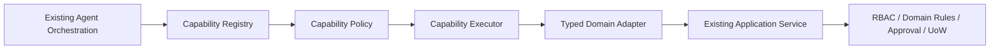

# PR2 Stage Contract — Capability Layer

## 1. Purpose and status

This document defines the permitted scope and testable exit conditions for PR2. It is a
stage contract, not evidence that PR2 has started or that the listed modules exist.

PR2 answers:

> What can the Agent do, and through which stable contract may orchestration request it?

The governing destination is
[`../ARCHITECTURE_NORTH_STAR.md`](../ARCHITECTURE_NORTH_STAR.md), and the ordered
migration context is [`../REFACTOR_ROADMAP.md`](../REFACTOR_ROADMAP.md).

## 2. Stage objective

PR2 MUST establish a typed Capability Layer containing:

- `CapabilitySpec`;
- `CapabilityRegistry`;
- `CapabilityPolicy`;
- `CapabilityExecutor`; and
- typed capability input and output contracts.

It MUST migrate repair and billing capability adapters and demonstrate at least one real
read capability and one real write capability through this path:



The Capability Registry is Agent orchestration metadata. It MUST live under the Agent
boundary and MUST NOT become a Platform domain or business authority.

## 3. In scope

- stable capability identity, description, typed request/response types, risk, approval,
  and orchestration-facing presentation metadata;
- deterministic registration and lookup of supported capabilities;
- policy decisions based on trusted runtime facts and capability metadata;
- bounded invocation, normalized results/errors, and observability hooks;
- typed adapters for selected repair and billing Application Service operations;
- migration of at least one real read and one real write capability;
- compatibility derivation for migrated `TOOL_LEVELS`, `TOOL_SLOTS`, presentation, and
  confirmation metadata;
- preservation/migration mapping for relevant `controlled_read.py` protections;
- focused contract, policy, executor, adapter, and legacy-compatibility tests; and
- a documented inventory of migrated and remaining legacy metadata.

## 4. Out of scope

PR2 MUST NOT introduce or undertake:

- LangGraph runtime, root graph, durable graph checkpointing, or interrupt/resume work;
- Supervisor or specialist multi-agent architecture;
- full typed `RuntimeContext` or `AgentState` migration;
- semantic, episodic, procedural, pgvector, or other long-term memory work;
- announcement or inspection full capability migration;
- large Runner rewrite or relocation of domain continuation state;
- Application Service, domain model, RBAC, approval subsystem, or P0 fencing rewrites;
- direct ORM/repository/SQL business mutations from the Capability Layer;
- shadow double-write or parallel execution of legacy and capability write paths; or
- retirement of the legacy runtime.

Extension points MAY be defined for later stages, but speculative implementations MUST
NOT be added.

## 5. Architecture constraints

### 5.1 Business authority

Every write adapter MUST call an existing Application Service. Policy and executor
checks are orchestration defenses and MUST NOT replace Application Service authorization,
approval, domain validation, UoW, audit, outbox, or transaction ownership.

The orchestration gate and authoritative transaction MUST remain distinct:

```text
CapabilityPolicy computes approval/HITL requirement
  -> Agent/Supervisor proposes action
  -> interrupt/wait for human confirmation when required
  -> CapabilityExecutor
  -> Typed Domain Adapter
  -> Application Service
  -> Unit of Work
       -> validate and bind authoritative approval token/state
       -> consume authoritative approval
       -> business mutation
       -> audit / outbox
  -> Commit
```

The orchestration gate only determines whether an invocation may proceed to the business
boundary. `CapabilityExecutor` MUST NOT independently validate or consume authoritative
approval. The existing Application Service/UoW transaction MUST validate actor, action,
parameters, token/state, and other live business conditions; approval consumption and
business mutation MUST commit or roll back atomically.

`CapabilityExecutor -> ORM`, `CapabilityExecutor -> repository.update(...)`, and
`CapabilityExecutor -> direct SQL business mutation` are forbidden.

### 5.2 Trust boundary

Trusted identity, roles, tenant/community/house scope, execution source, conversation/run
identity, and lease/fence data MUST come from server-created context. Capability input
schemas MUST NOT expose trusted fields as model-controlled authority.

If compatibility requires a similarly named field in a legacy payload, the adapter MUST
derive or validate it against trusted context; model values MUST NOT widen authority.

### 5.3 Policy semantics

`CapabilitySpec` declares static capability identity, contracts, and baseline metadata.
It MUST NOT encode every invocation's effective risk or approval result as an invariant
boolean.

`CapabilityPolicy` MUST provide the single deterministic path for invocation-specific
orchestration classification. From the `CapabilitySpec`, validated typed capability
input, trusted `RuntimeContext`, and bounded invocation state, it SHOULD evaluate
allowlisting, effective risk, approval/HITL requirements, trusted scope, execution budget,
step/deadline constraints, and duplicate-call rules. Its result MAY include
allow/deny/human-only and an effective approval requirement. A policy allow decision
permits an attempt; it does not prove live business authorization or success.

Dynamic business rules, live domain state, and authoritative authorization remain in the
Application Service.

### 5.4 Approval and correctness

Static capability metadata MUST have one canonical source in the Registry. Effective
invocation classification MUST have one deterministic `CapabilityPolicy` path.
Application Services remain authoritative for live business authorization, dynamic
business rules, and approval state.

The Agent or Supervisor MAY propose an action, and orchestration MAY interrupt and wait
for human confirmation when policy requires it. This is an orchestration-level gate, not
authoritative approval consumption. `CapabilityExecutor` MUST NOT independently consume
authoritative approval. Approval token/state validation, actor/action/parameter binding,
and consumption MUST remain inside the existing Application Service/UoW transaction.
Approval consumption and business mutation MUST be atomic; an `approval consumed` state
MUST NOT survive when the associated business mutation fails.

Checkpoint CAS, memory CAS, run lease, heartbeat, fencing, stale-worker rejection,
approval atomicity, idempotency, audit, outbox, and `CLOSED` terminal behavior MUST
remain unchanged unless a real regression fix is separately justified.

### 5.5 Controlled-read protections

PR2 MUST inventory the protections currently implemented by `controlled_read.py` and map
each relevant protection to one of:

- retained legacy guard;
- migrated `CapabilityPolicy` rule;
- migrated `CapabilityExecutor` bound; or
- explicitly deferred graph execution policy.

No protection MAY disappear during migration. `controlled_read.py` MUST NOT be deleted in
PR2 unless equivalent behavior is proven for all current call paths and compatibility
users; deletion is not a PR2 objective.

## 6. Expected modules

The preferred production location is:

```text
src/property_agent/agent/capabilities/
├── __init__.py
├── contracts.py       # CapabilitySpec and typed invocation/result contracts
├── registry.py        # deterministic registration and lookup
├── policy.py          # orchestration policy decisions
├── executor.py        # bounded invocation and normalized outcomes
├── compatibility.py   # derived legacy metadata views
└── adapters/
    ├── __init__.py
    ├── repair.py       # typed adapters to repair Application Services
    └── billing.py      # typed adapters to billing Application Services
```

Exact filenames MAY change to fit repository conventions. Ownership MUST remain under
`property_agent.agent`; `platform/capability_registry` is not an acceptable location.
Factories MAY assemble these dependencies but MUST NOT absorb policy, invocation, or
business logic.

## 7. Contract responsibilities

### 7.1 CapabilitySpec

`CapabilitySpec` MUST provide a stable capability identifier and typed input/output
contract. It SHOULD centralize static orchestration metadata needed for discovery,
baseline risk/approval posture, presentation, and compatibility without embedding
callable business logic or invocation-specific business decisions.

### 7.2 CapabilityRegistry

`CapabilityRegistry` MUST support deterministic registration, duplicate detection,
lookup, and inventory. For migrated capabilities it becomes the source of truth for
migrated orchestration metadata. It MUST NOT decide live RBAC or query business state.

### 7.3 CapabilityPolicy

`CapabilityPolicy` MUST produce an explicit invocation-specific classification from a
capability specification, validated typed input, trusted context, and bounded invocation
state. Effective risk and allow/deny/human-only/approval-required outcomes MUST be
deterministic, testable, and independent of LLM claims.

### 7.4 CapabilityExecutor

`CapabilityExecutor` MUST enforce the policy result and invocation bounds, call exactly
one selected typed adapter per invocation, and normalize success/error output for
orchestration. It MUST NOT own database sessions, domain transactions, approval truth,
or authoritative approval consumption.

### 7.5 Typed domain adapters

Adapters MUST translate typed capability input plus trusted context into existing
Application Service calls and translate their responses into typed capability outputs.
They MUST preserve public business errors and security semantics rather than reimplement
them.

## 8. Migration strategy

1. Inventory repair/billing tool contracts and all related `TOOL_LEVELS`, `TOOL_SLOTS`,
   presentation, confirmation, and controlled-read metadata.
2. Add typed contracts and registry entries without changing the active legacy call path.
3. Add deterministic policy and executor behavior with focused tests.
4. Add typed repair and billing adapters that call existing Application Services.
5. Migrate one read path, verify equivalence, and derive its legacy metadata from the
   registry.
6. Migrate one write path, preserving approval, fencing, idempotency, audit, outbox, and
   transaction behavior; ensure only one path executes the mutation.
7. Expand repair/billing coverage within PR2 scope and record remaining legacy metadata.
8. Keep runtime behavior compatible behind the smallest necessary adapter/flag boundary.

Each migrated capability MUST have one active invocation path. Compatibility views MAY
duplicate representation temporarily, but MUST NOT duplicate business execution.

## 9. Legacy metadata compatibility

For each legacy metadata family, PR2 MUST classify every entry as **migrated**,
**derived**, **retained**, or **deferred**:

| Metadata | PR2 expectation |
| --- | --- |
| `TOOL_LEVELS` | Migrated repair/billing baseline levels derive from static registry metadata where semantics match; effective invocation risk comes from `CapabilityPolicy`. |
| `TOOL_SLOTS` | Migrated repair/billing slots derive from typed input contracts or an explicit compatibility projection. |
| Presentation metadata | Centralize orchestration-facing metadata where stable; keep domain response formatting outside the registry. |
| Confirmation metadata | Registry describes static baseline posture; `CapabilityPolicy` computes the effective invocation requirement; authoritative approval validation and consumption remain in Application Services/UoW. |
| `controlled_read.py` semantics | Retain or map each guard explicitly; do not remove coverage. |

Compatibility output MUST preserve public tool names, signatures where contracted,
response shapes, error behavior, confirmation gates, and fallback order unless a behavior
change is explicitly reviewed outside a mechanical migration.

## 10. Test requirements

PR2 MUST add or update focused tests under `tests/` for:

- typed input acceptance and invalid-input rejection;
- typed output and normalized error contracts;
- registry lookup, duplicate registration, stable inventory, and unknown capability;
- policy allow/deny/approval-required decisions;
- model attempts to override identity, role, scope, or execution source;
- execution budget, step/deadline, allowlist, and duplicate-call behavior in PR2 scope;
- repair and billing adapter calls to existing Application Services;
- one real read capability end to end through the Capability Layer;
- one real write capability end to end through the Capability Layer;
- approval/fencing/idempotency/audit/outbox preservation for the migrated write path;
- no shadow double-write;
- legacy metadata derivation and compatibility; and
- retained or migrated controlled-read security semantics.

The stage MUST run focused tests first, then repository Ruff lint/format checks,
`scripts/check_code_structure.py`, the complete local suite, real PostgreSQL tests, and
the existing frontend/browser gates required by repository policy. Evidence MUST
distinguish local, PostgreSQL integration, remote CI, and human acceptance status.

## 11. Exit criteria

PR2 is complete only when:

1. `CapabilitySpec`, `CapabilityRegistry`, `CapabilityPolicy`, and
   `CapabilityExecutor` exist as separated responsibilities.
2. Capability inputs and outputs are type-enforced at the execution boundary.
3. Repair and billing have typed adapters to existing Application Services.
4. At least one real read and one real write capability execute through the Capability
   Layer.
5. The registry is the source of truth for migrated static capability metadata, with an
   inventory of remaining legacy metadata.
6. Effective invocation risk and approval/HITL classification follow one deterministic
   `CapabilityPolicy` path using typed input, trusted context, and bounded invocation
   state.
7. Migrated `TOOL_LEVELS`, `TOOL_SLOTS`, presentation, and confirmation metadata are
   derived or explicitly mapped without conflicting static sources of truth.
8. Trusted identity/scope cannot be overridden through model-controlled arguments.
9. Application Services remain the sole business authority; no capability component
   directly mutates business persistence.
10. Authoritative approval validation/binding/consumption remains inside the Application
    Service/UoW transaction and is atomic with the business mutation.
11. P0 fencing, approval transaction semantics, CAS, idempotency, audit, outbox, and
   terminal lifecycle behavior remain intact.
12. Controlled-read protections are retained or demonstrably migrated with no safety
    regression.
13. There is no shadow double-write, and the old runtime remains compatible.
14. Focused, full local, real PostgreSQL, and required remote quality gates are green.

PR2 MUST NOT claim completion based only on unit tests or static inspection.

## 12. Document authority and conflict handling

Architecture guidance is interpreted in this order:

1. current repository and production facts;
2. [`../ARCHITECTURE_NORTH_STAR.md`](../ARCHITECTURE_NORTH_STAR.md);
3. [`../REFACTOR_ROADMAP.md`](../REFACTOR_ROADMAP.md);
4. this stage contract; and
5. historical reports.

If repository facts reveal an implementation defect, PR2 MUST classify it explicitly;
ordinary defects do not authorize expanding the stage. If this stage contract conflicts
with the North Star, the affected work MUST stop and record `ARCHITECTURE_CONFLICT`.

Changing the business authority boundary, Capability Registry ownership,
`RuntimeContext` trust model, LangGraph responsibility, or memory authority model
requires an explicit ADR. PR2 MUST NOT make such a change implicitly.
